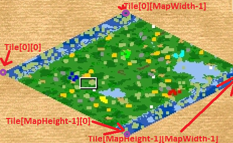

# Tiles

## About

Scenario is two-dimensional array of [class.Tile](#), you can iterate over them with for loop or get tile with indexes. There's plenty of helpfull methods, which make using tiles easier.



## Attributes

- width (readonly): scenario width
- height (readonly): scenario height

## Methods

- **toJSON()**: return dict()
- **size()**: return size
- **resize(newWidth, newHeight)**: resize scenario
- **row(row)**: return tiles from row number
- **collumn(collumn)**: return collumn tiles from col number
- **clearTerrain(terrainType=0)**: set all tiles to terrain type
- **clearElevation(elevation=0)**: set whole elevation to elevation=0
- **getByTerrain(terrainType)**: return tiles with specific terrain type
- **getByElevation(elevation)**: return tiles with specific elevation
- **getArea(x1, y1, x2, y2)**: return tiles within selected area
- **replaceTerrain(terrainType, newType)**: replace whole terrain with new terrain type
- **incElevation(increase=1)**: increase elevation on all tiles
- **decElevation(decrease=1)**: decrease elevation on all tiles

## Examples

Placing desert in middle of map

```python
>>> size = 8  # grid size
>>> cx = cy = scenario.tiles.width // 2   # center coordinations
>>> grid = scenario.tiles.getArea(cx, cy, cx+size, cy+size)
>>> for tile in grid:
>>>     tile.type = 4
```
